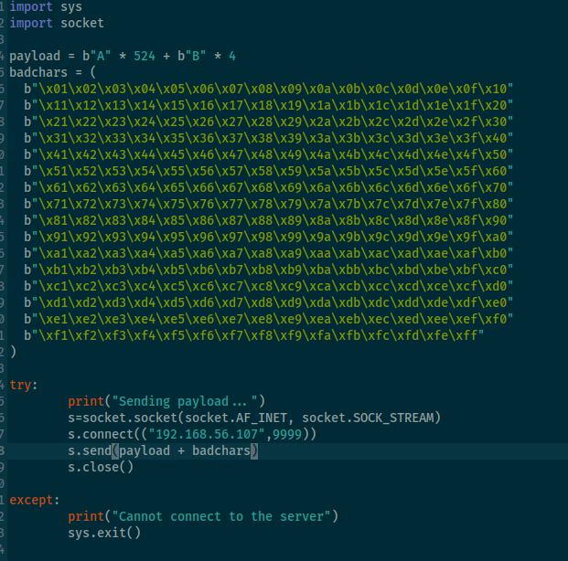
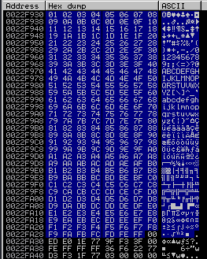

::: page
# Bad-chars {#bad-chars .title}

\

We found bad chars from github and **changed our script to check for bad
chars**:

Run the script again to check :

Selected **ESP** and clicked on **follow dump** :

Sequence is proper till **FF**
:::
