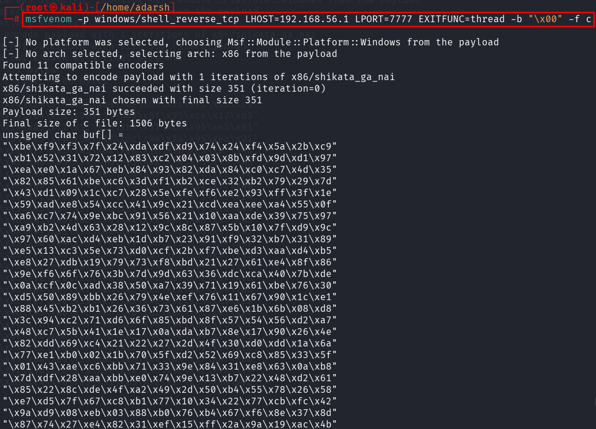
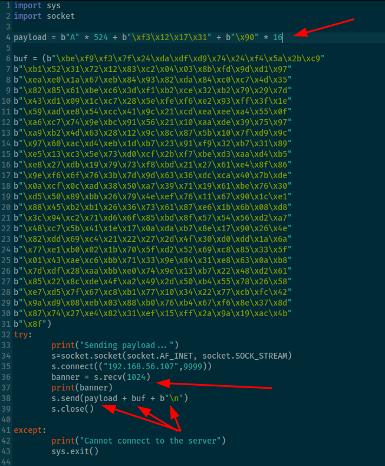

::: page
# Generating shell code {#generating-shell-code .title}

\

Lets **generate a shell code using msfvenom** (for testing on windows):

In our script :

NOTE : **b\"\\x90\" \* 16** this is padding added between the
**payload** and **exploit**
:::
