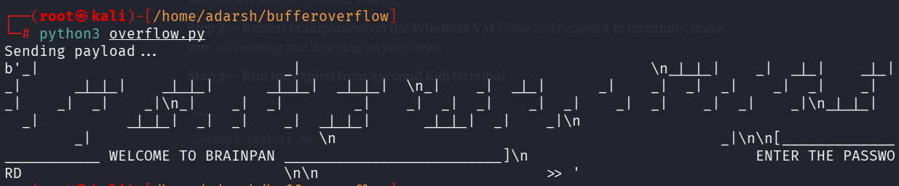
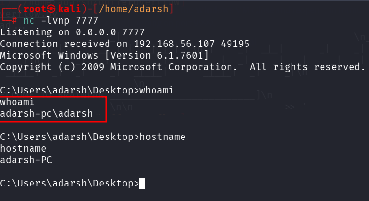

::: page
# Getting Shell {#getting-shell .title}

\

Lets run the script to get a shell.

This time we **ran only brainpan.exe and not immunity**

On our **listener** :

The exploit is **fully developed** now.

**Lets target this exploit to the linux machine now**.
:::
