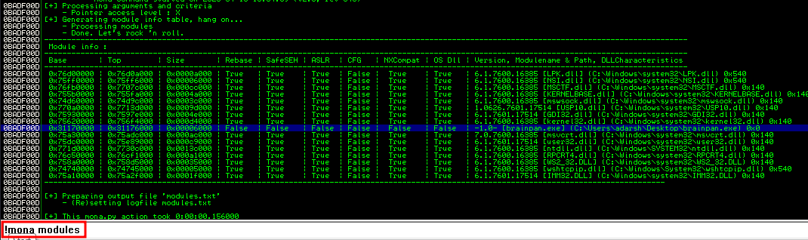
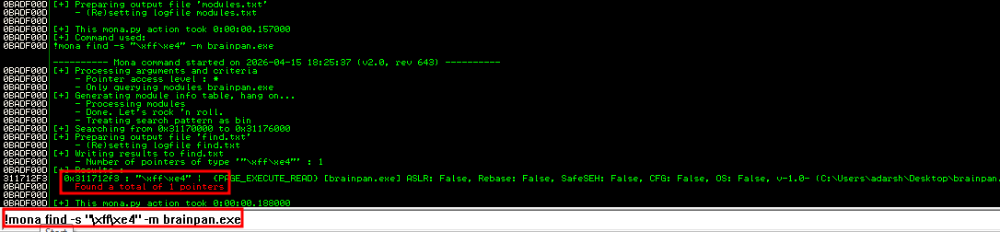
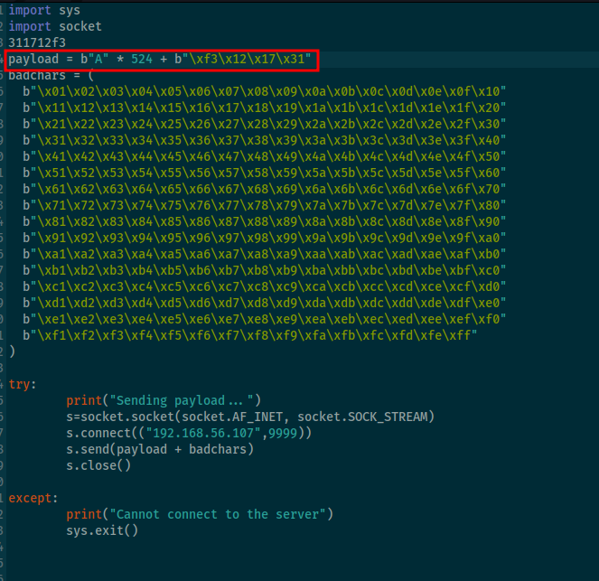
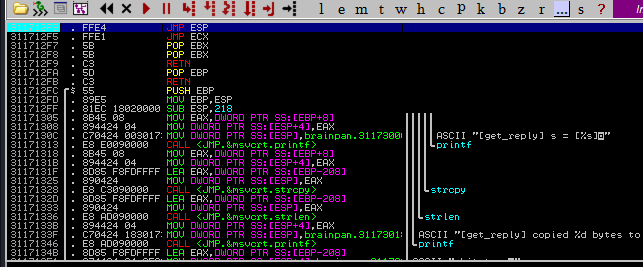
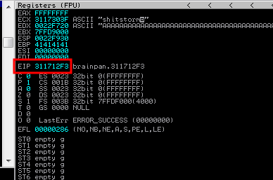

::: page
# mona modules {#mona-modules .title}

\

We have **placed mona modules inside the pycommands**.

To check for the right module to exploit, will use **!mona modules**
command :

We are basically looking for **brainpan.exe and all security permissions
false** and we got this.

Since we want to **overwrite the EIP** with the **JMP ESP instruction**,
we use **mona** to find the instruction inside **brainpan.exe**.

Converted **ASSEMBLY to HEX CODE** (**JMP ESP = FFE4**)

We got the r**eturn address of the JMP ESP** and now lets make changes
inside the script to **change the EIP to this return address**.

Also, lets set a breakpoint for the instruction **311712f3**, so that
when the **program reached that instruction it stops** and waits for us.

Breakpoint was set.

Now lets test.

We have successfully overwritten the **EIP with JMP ESP**.
:::
