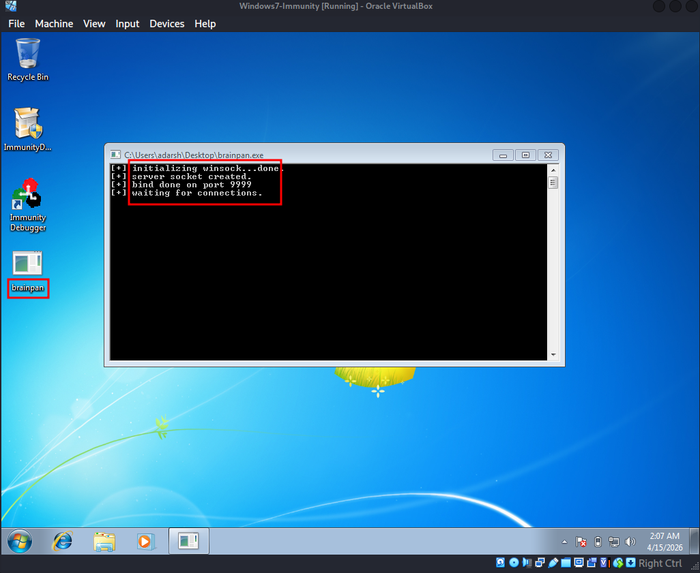
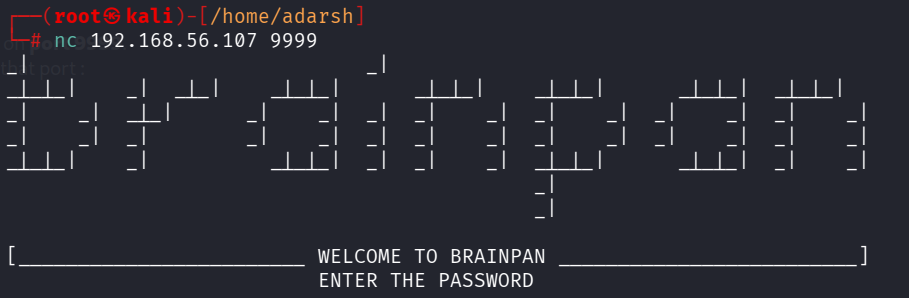
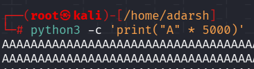
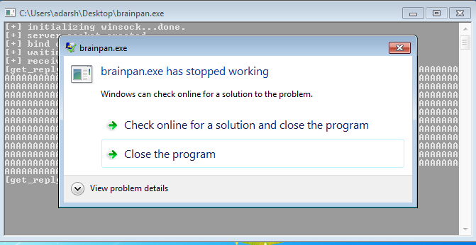
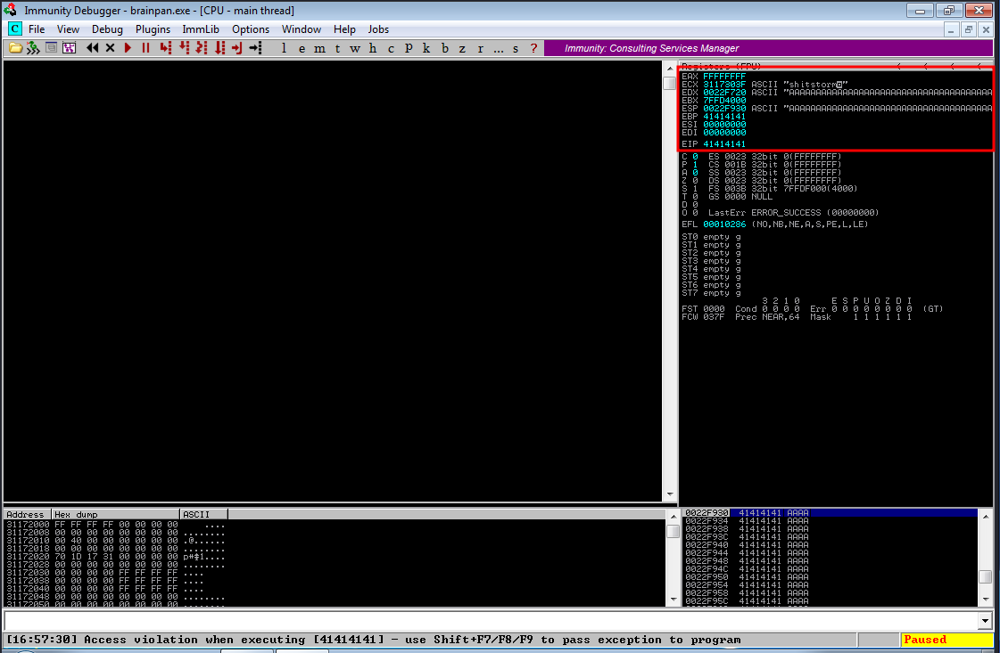

::: page
# Spiking/Fuzzing {#spikingfuzzing .title}

\

We ran brainpan.exe on windows :

Says listening on **port 9999**.

We **netcat** to that port :

It is asking us for a **password**.

Lets generate a **large string of "A"** and **pass this as a password**
to see how the chat application responses :

We got this **error** :

This confirms we can **overflow the buffer**.

Lets check the **immunity debugger** output :

Here, we can see that **EIP can be controlled** and hence we can
**overflow the buffer to execute out patload and get root.**
:::
