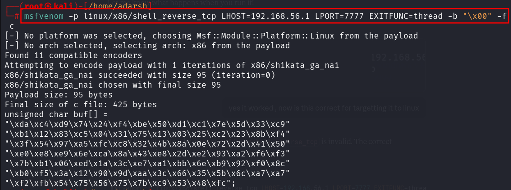
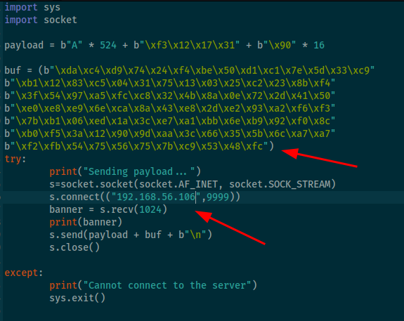
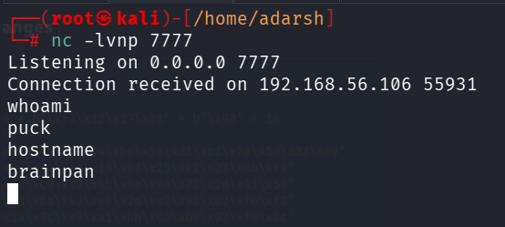

::: page
# Targetting to actual machine {#targetting-to-actual-machine .title}

\

Generated **new payload for linux** :

In **script made changes** :

Ran this and **got a shell** :

We got a **low level user.**
:::
