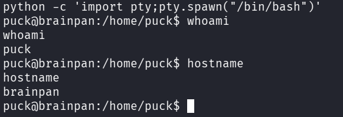
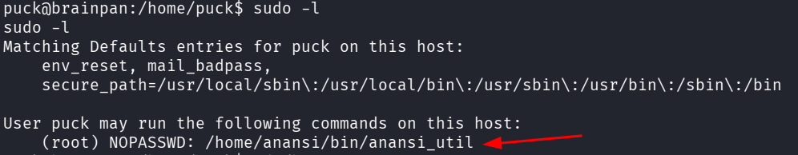
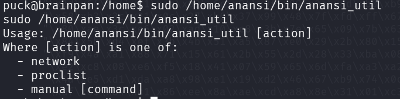
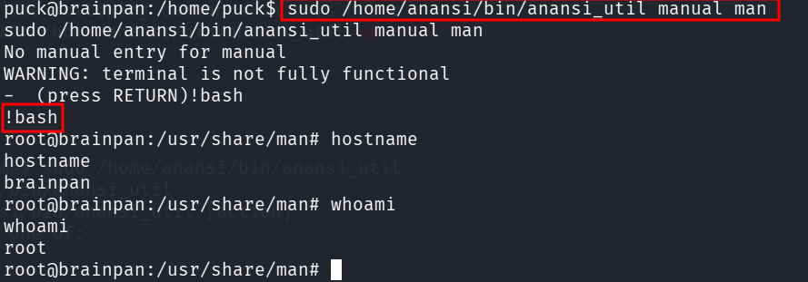

::: page
# manual man {#manual-man .title}

\

First we got a **tty shell** :

Checked **sudo -l** :

**We got this** :

Now, used the **manual man** privesc from **GTFObins** and typed
**!bash** to get **root** :

We are **root!!!**
:::
