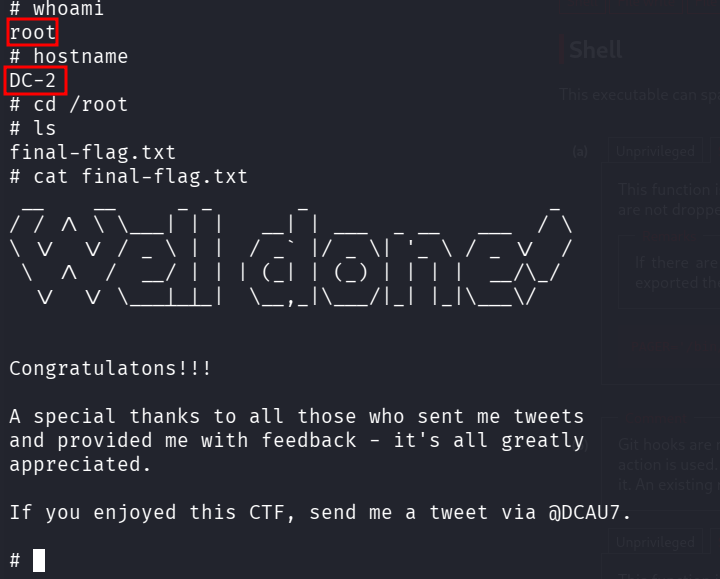

::: page
# Privilege Escalation {#privilege-escalation .title}

\

We found that user **jerry can run git with sudo.**

Exploited using **git** :

This opened a **man page** where we typed : **!/bin/sh**

**We are root!!!**
:::
