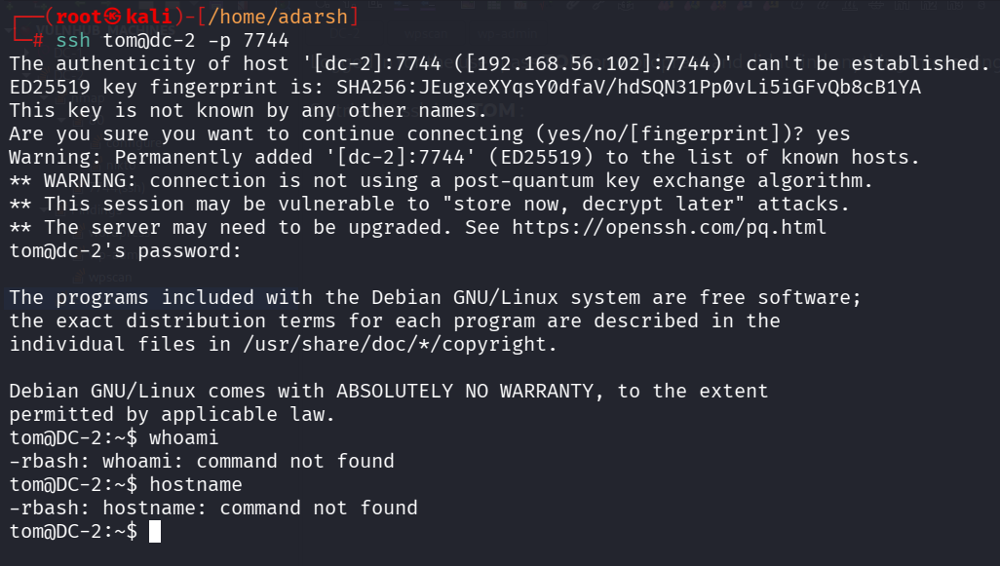
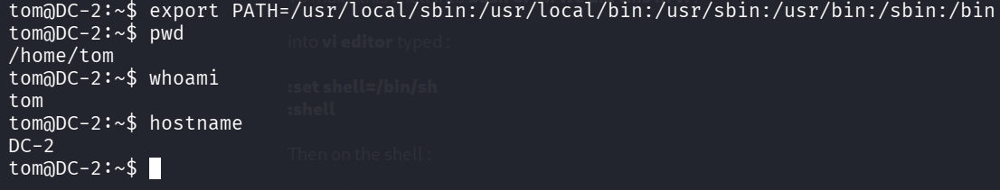
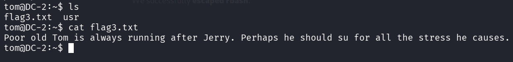

::: page
# ssh into TOM {#ssh-into-tom .title}

\

Logged in for the user pass **TOM** on wordpress and didnt find anything
interesting.

So tried to ssh into **TOM** :

This is a **restricted shell**.

To make this shell into **bash or sh we did this in vi** :

into **vi editor** typed :

**:set shell=/bin/sh**

**:shell**

Then on the shell :

Then we **fixed path** :

We successfully **escaped rbash**.

Lets do lateral digging into **jerry** as well.
:::
