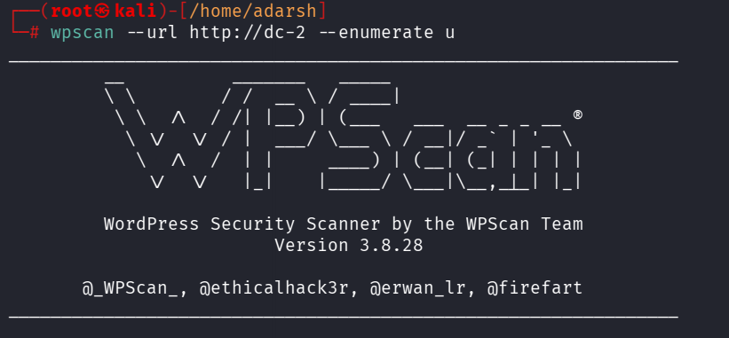
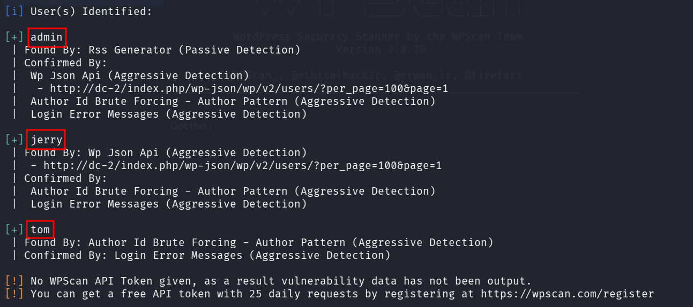
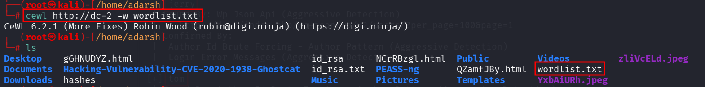
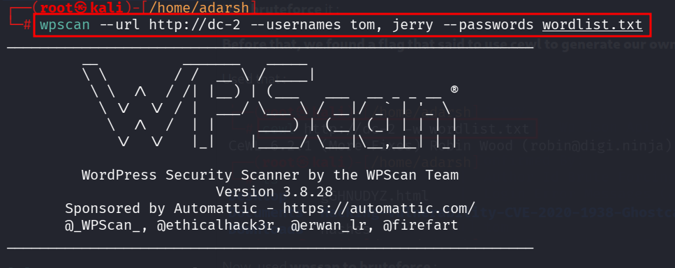
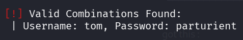

::: page
# wpscan {#wpscan .title}

\

Installed a wordpress scan tool called **wpscan** :

Got this :

Lets **bruteforce** it :

**Before that, we found a flag that said to use cewl to generate our own
wordlist.**

Used that :

Now, used **wpscan to bruteforce** :

got this :

:::
