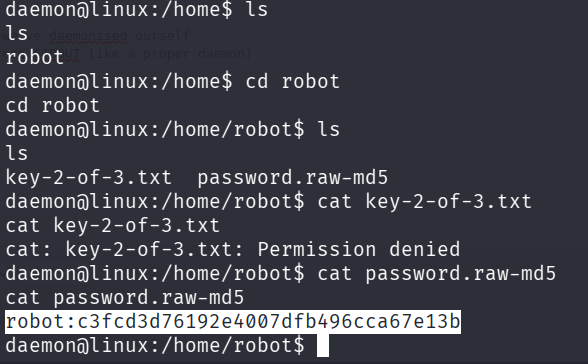
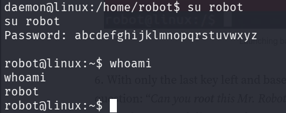
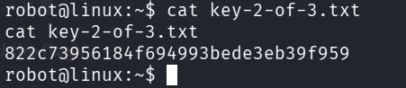
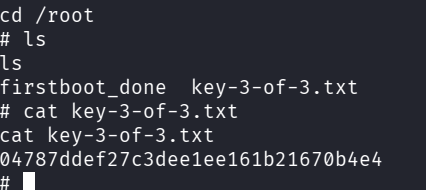

::: page
# privilege escalation 1 {#privilege-escalation-1 .title}

\

We got an **md5 hash**.

Decrypted it using **crackstation** : **abcdefghijklmnopqrstuvwxyz**

Switched user to **robot** :

Then we **opened the flag :**

**This is an md5 hash but we were not able to crack this.**

:::
