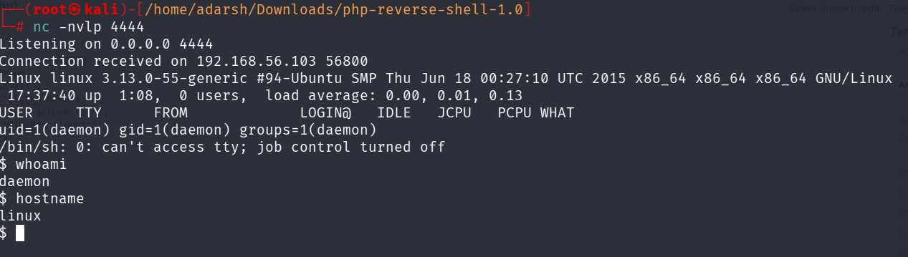
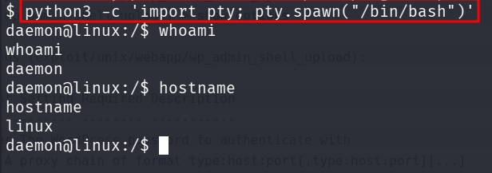

::: page
# reverse shell {#reverse-shell .title}

\

We saw that user **elliot** is an **administrator**.

We visited the **appearance\>editor** page which contained various **php
scripts**

We edited one of the scripts : (used php_reverse_shell from
pentestmonkey)

Listened on port 4444 simultaneously.

Converted this into a **tty shell** :

:::
