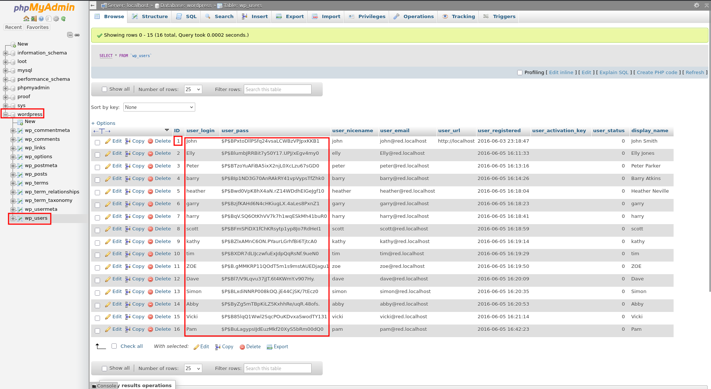
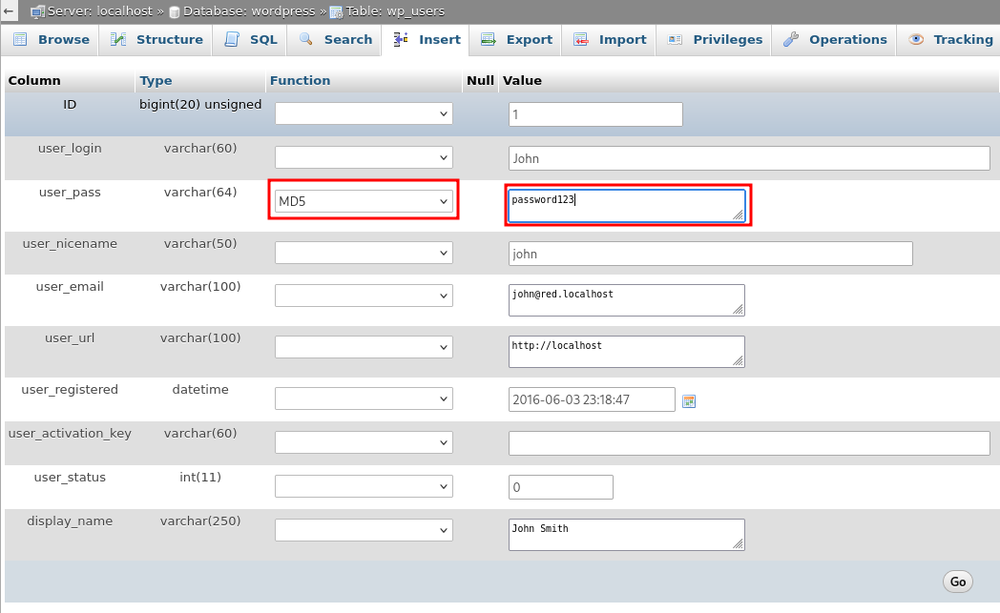
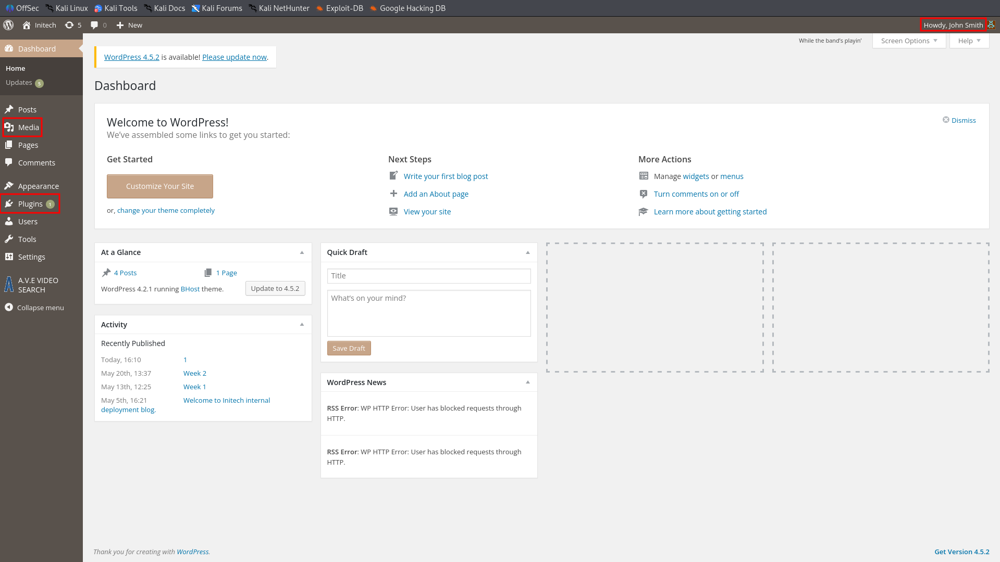
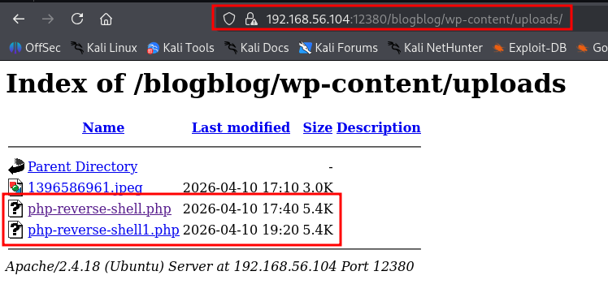
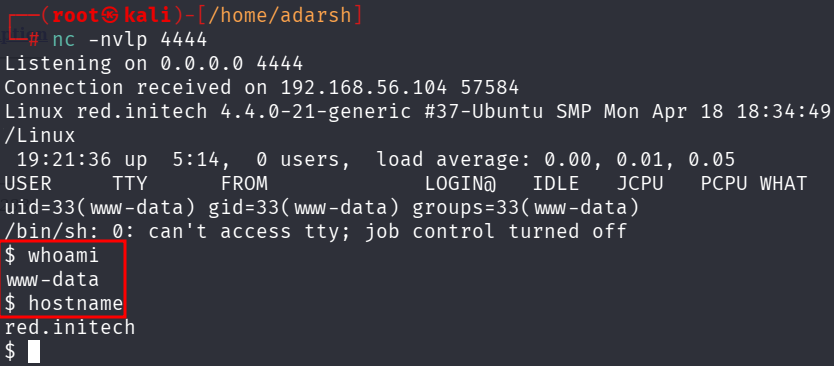

::: page
# phpmyadmin login {#phpmyadmin-login .title}

\

Lets use the creds to login into **phpmyadmin** :

**We have a list of hashes we can crack and then login with the password
into wp and then inject a php reverse shell to get a shell**.

But here since we are admin and we have **edit permissions**, lets
**change the password of john and login directly to john**.

Now, we loggen in using : **john password123**

Now we upload a **php reverse shell and get a shell** :

we got a shell :

We got a **low level user**.

From here we can **escalate our privileges** using **kernel exploit** by
running **linpeas**.
:::
