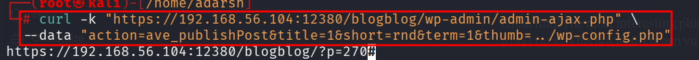
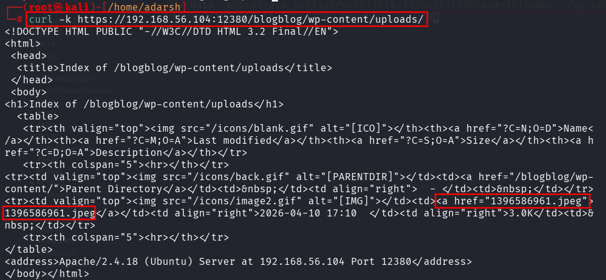
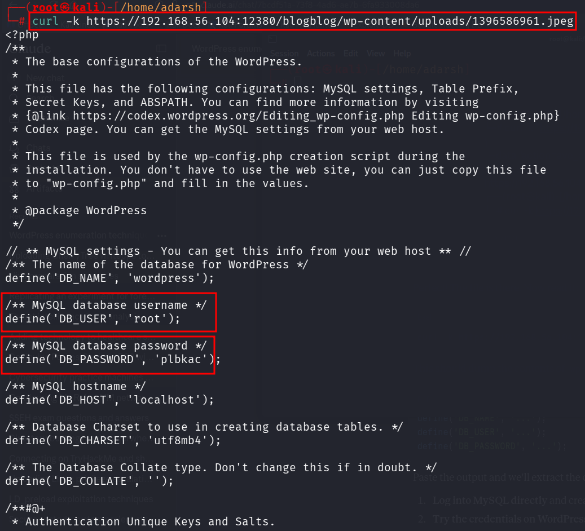

::: page
# Wpscan continue {#wpscan-continue .title}

\

From the plugins **this one had a vulnerability** :

\"**advanced-video-embed-embed-videos-or-playlists**\"

**This plugin has a Local File Inclusion (LFI) vulnerability\</strong\>
--- it allows you to read files from the server without needing admin
access**, including **wp-config.php**

This creates a post with **wp-config.php** contents embedded as a
thumbnail. Then check the **uploads directory.**

We can see a **newly created jpeg file,** lets read it :

We got **credentials !!!**
:::
