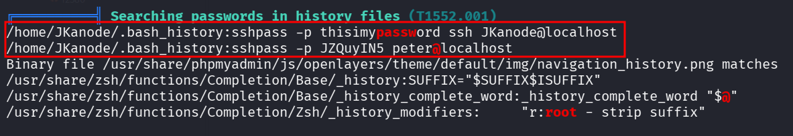
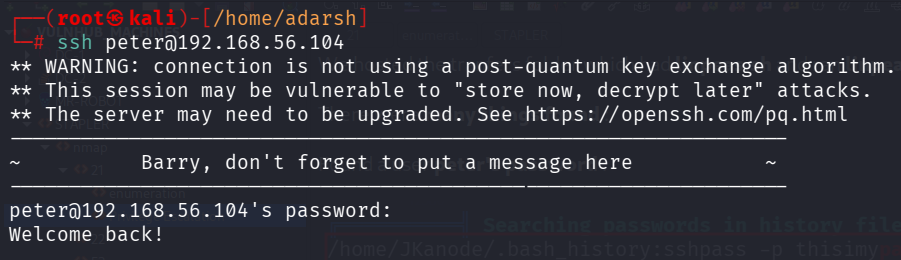
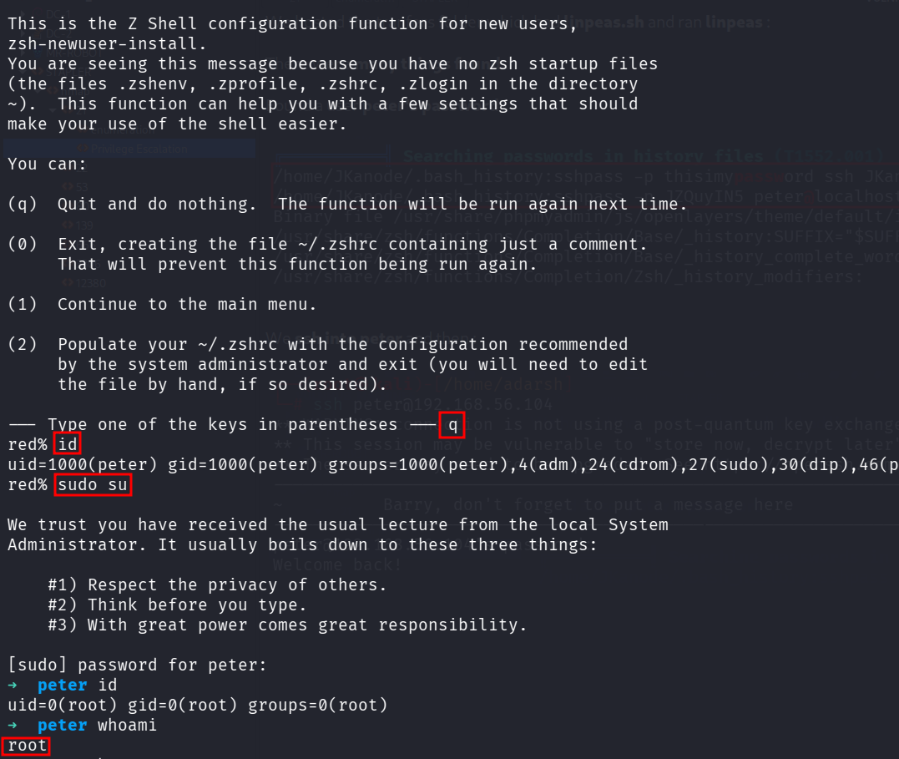
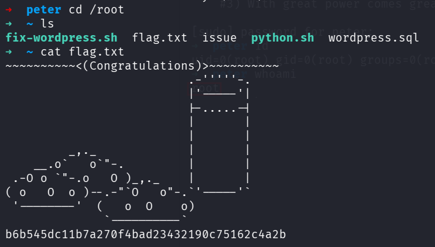

::: page
# Privilege Escalation {#privilege-escalation .title}

\

We hosted the tranfers folder which had **linpeas.sh** and ran
**linpeas** :

There were **many things found** :

Found a user **peter\'s password** :

We **ssh into peter** and then :

**We are root!!!**
:::
