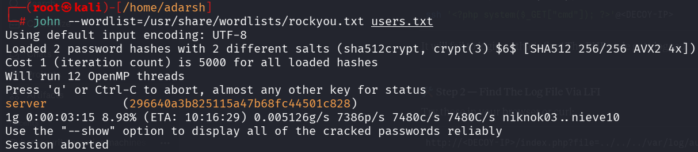
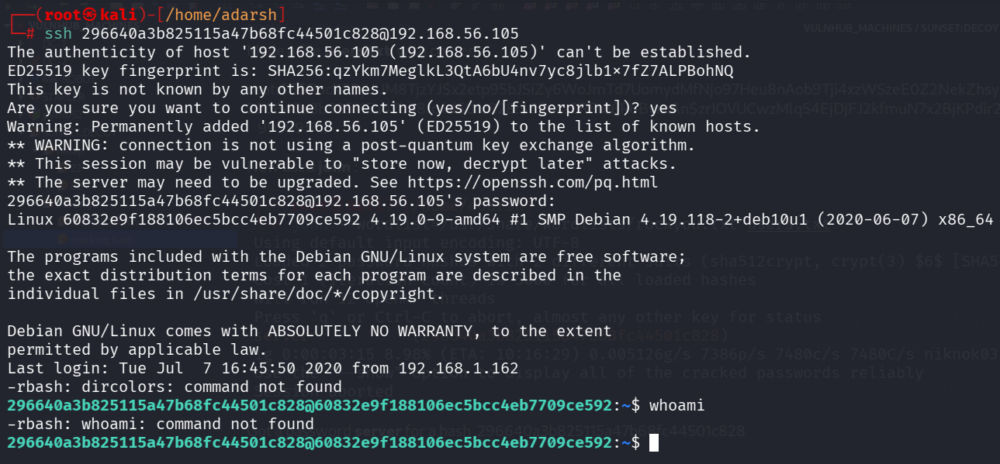
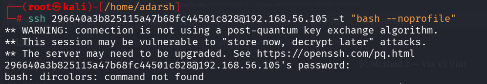
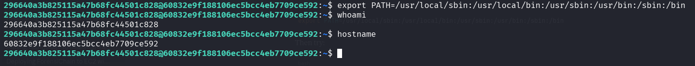

::: page
# cracking hash {#cracking-hash .title}

\

Made a file **users.txt** with content:

root:\$6\$RucK3DjUUM8TjzYJ\$x2etp95bJSiZy6WoJmTd7UomydMfNjo97Heu8nAob9Tji4xzWSzeE0Z2NekZhsyCaA7y/wbzI.2A2xIL/uXV9.:18450:0:99999:7:::

296640a3b825115a47b68fc44501c828:\$6\$x4sSRFte6R6BymAn\$zrIOVUCwzMlq54EjDjFJ2kfmuN7x2BjKPdir2Fuc9XRRJEk9FNdPliX4Nr92aWzAtykKih5PX39OKCvJZV0us.:18450:0:99999:7:::

Now used **john** :

Got a password **server** for a hash 296640a3b825115a47b68fc44501c828

Tried ssh :

We got a low level user but its an **rbash shell**.

We tried escaping rbash using **vi/vim** but were not able to.

SSH\'ed differently then :

Got a **bit more interective shell**.

Fixed path :

\*\*( IMPORTANT : **PATH** is an **environment variable** that tells
your shell where to look for commands when you type them.)\*\*
:::
