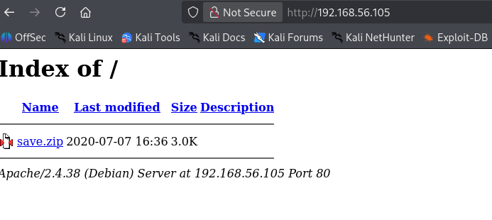
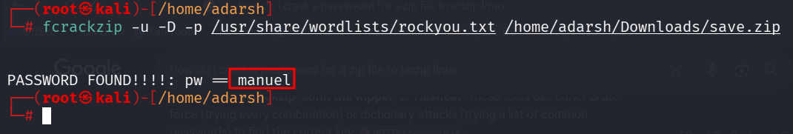

::: page
# 192.168.56.105 {#section .title}

\

Used **fcrackzip** to crack the **zip file password** :

After **unzipping found these** :

**/etc/group** :

cat group

root:x:0:

daemon:x:1:

bin:x:2:

sys:x:3:

adm:x:4:

tty:x:5:

disk:x:6:

lp:x:7:

mail:x:8:

news:x:9:

uucp:x:10:

man:x:12:

proxy:x:13:

kmem:x:15:

dialout:x:20:

fax:x:21:

voice:x:22:

cdrom:x:24:

floppy:x:25:

tape:x:26:

sudo:x:27:

audio:x:29:

dip:x:30:

www-data:x:33:

backup:x:34:

operator:x:37:

list:x:38:

irc:x:39:

src:x:40:

gnats:x:41:

shadow:x:42:

utmp:x:43:

video:x:44:

sasl:x:45:

plugdev:x:46:

staff:x:50:

games:x:60:

users:x:100:

nogroup:x:65534:

systemd-journal:x:101:

systemd-timesync:x:102:

systemd-network:x:103:

systemd-resolve:x:104:

input:x:105:

kvm:x:106:

render:x:107:

crontab:x:108:

netdev:x:109:

messagebus:x:110:

bluetooth:x:111:

ssl-cert:x:112:

avahi-autoipd:x:113:

ssh:x:114:

lpadmin:x:115:

scanner:x:116:saned

avahi:x:117:

saned:x:118:

colord:x:119:

systemd-coredump:x:999:

296640a3b825115a47b68fc44501c828:x:1000:

**/etc/hostname** :

cat hostname

60832e9f188106ec5bcc4eb7709ce592

**/etc/hosts** :

cat hosts

127.0.0.1 localhost

127.0.1.1 decoy

\# The following lines are desirable for IPv6 capable hosts

::1 localhost ip6-localhost ip6-loopback

ff02::1 ip6-allnodes

ff02::2 ip6-allrouters

**/etc/passwd** :

cat passwd

root:x:0:0:root:/root:/bin/bash

daemon:x:1:1:daemon:/usr/sbin:/usr/sbin/nologin

bin:x:2:2:bin:/bin:/usr/sbin/nologin

sys:x:3:3:sys:/dev:/usr/sbin/nologin

sync:x:4:65534:sync:/bin:/bin/sync

games:x:5:60:games:/usr/games:/usr/sbin/nologin

man:x:6:12:man:/var/cache/man:/usr/sbin/nologin

lp:x:7:7:lp:/var/spool/lpd:/usr/sbin/nologin

mail:x:8:8:mail:/var/mail:/usr/sbin/nologin

news:x:9:9:news:/var/spool/news:/usr/sbin/nologin

uucp:x:10:10:uucp:/var/spool/uucp:/usr/sbin/nologin

proxy:x:13:13:proxy:/bin:/usr/sbin/nologin

www-data:x:33:33:www-data:/var/www:/usr/sbin/nologin

backup:x:34:34:backup:/var/backups:/usr/sbin/nologin

list:x:38:38:Mailing List Manager:/var/list:/usr/sbin/nologin

irc:x:39:39:ircd:/var/run/ircd:/usr/sbin/nologin

gnats:x:41:41:Gnats Bug-Reporting System
(admin):/var/lib/gnats:/usr/sbin/nologin

nobody:x:65534:65534:nobody:/nonexistent:/usr/sbin/nologin

\_apt:x:100:65534::/nonexistent:/usr/sbin/nologin

systemd-timesync:x:101:102:systemd Time
Synchronization,,,:/run/systemd:/usr/sbin/nologin

systemd-network:x:102:103:systemd Network
Management,,,:/run/systemd:/usr/sbin/nologin

systemd-resolve:x:103:104:systemd
Resolver,,,:/run/systemd:/usr/sbin/nologin

messagebus:x:104:110::/nonexistent:/usr/sbin/nologin

avahi-autoipd:x:105:113:Avahi autoip
daemon,,,:/var/lib/avahi-autoipd:/usr/sbin/nologin

sshd:x:106:65534::/run/sshd:/usr/sbin/nologin

avahi:x:107:117:Avahi mDNS
daemon,,,:/var/run/avahi-daemon:/usr/sbin/nologin

saned:x:108:118::/var/lib/saned:/usr/sbin/nologin

colord:x:109:119:colord colour management
daemon,,,:/var/lib/colord:/usr/sbin/nologin

hplip:x:110:7:HPLIP system user,,,:/var/run/hplip:/bin/false

systemd-coredump:x:999:999:systemd Core Dumper:/:/usr/sbin/nologin

296640a3b825115a47b68fc44501c828:x:1000:1000:,,,:/home/296640a3b825115a47b68fc44501c828:/bin/rbash

**/etc/shadow** :

cat shadow

root:\$6\$RucK3DjUUM8TjzYJ\$x2etp95bJSiZy6WoJmTd7UomydMfNjo97Heu8nAob9Tji4xzWSzeE0Z2NekZhsyCaA7y/wbzI.2A2xIL/uXV9.:18450:0:99999:7:::

daemon:\*:18440:0:99999:7:::

bin:\*:18440:0:99999:7:::

sys:\*:18440:0:99999:7:::

sync:\*:18440:0:99999:7:::

games:\*:18440:0:99999:7:::

man:\*:18440:0:99999:7:::

lp:\*:18440:0:99999:7:::

mail:\*:18440:0:99999:7:::

news:\*:18440:0:99999:7:::

uucp:\*:18440:0:99999:7:::

proxy:\*:18440:0:99999:7:::

www-data:\*:18440:0:99999:7:::

backup:\*:18440:0:99999:7:::

list:\*:18440:0:99999:7:::

irc:\*:18440:0:99999:7:::

gnats:\*:18440:0:99999:7:::

nobody:\*:18440:0:99999:7:::

\_apt:\*:18440:0:99999:7:::

systemd-timesync:\*:18440:0:99999:7:::

systemd-network:\*:18440:0:99999:7:::

systemd-resolve:\*:18440:0:99999:7:::

messagebus:\*:18440:0:99999:7:::

avahi-autoipd:\*:18440:0:99999:7:::

sshd:\*:18440:0:99999:7:::

avahi:\*:18440:0:99999:7:::

saned:\*:18440:0:99999:7:::

colord:\*:18440:0:99999:7:::

hplip:\*:18440:0:99999:7:::

systemd-coredump:!!:18440::::::

296640a3b825115a47b68fc44501c828:\$6\$x4sSRFte6R6BymAn\$zrIOVUCwzMlq54EjDjFJ2kfmuN7x2BjKPdir2Fuc9XRRJEk9FNdPliX4Nr92aWzAtykKih5PX39OKCvJZV0us.:18450:0:99999:7:::

**/etc/sudoers** :

cat sudoers

\#

\# This file MUST be edited with the \'visudo\' command as root.

\#

\# Please consider adding local content in /etc/sudoers.d/ instead of

\# directly modifying this file.

\#

\# See the man page for details on how to write a sudoers file.

\#

Defaults env_reset

Defaults mail_badpass

Defaults
secure_path=\"/usr/local/sbin:/usr/local/bin:/usr/sbin:/usr/bin:/sbin:/bin\"

\# Host alias specification

\# User alias specification

\# Cmnd alias specification

\# User privilege specification

root ALL=(ALL:ALL) ALL

\# Allow members of group sudo to execute any command

%sudo ALL=(ALL:ALL) ALL

\# See sudoers(5) for more information on \"#include\" directives:

#includedir /etc/sudoers.d
:::
