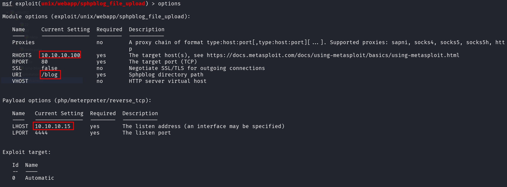
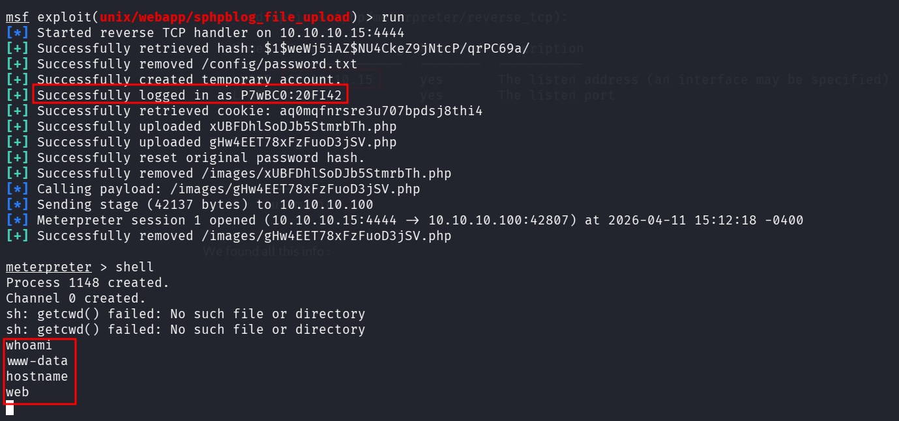
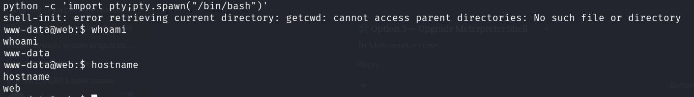
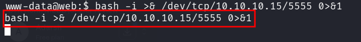
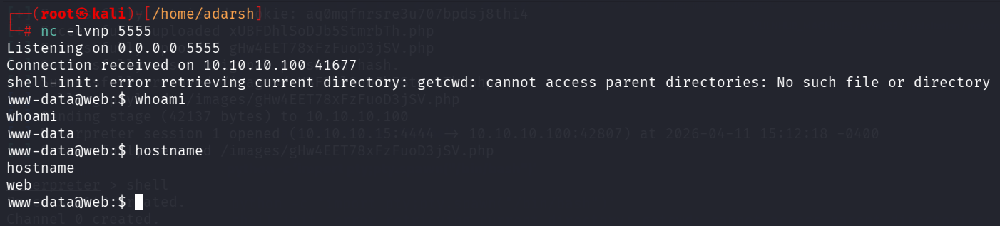

::: page
# msfconsole {#msfconsole .title}

\

We found that /blog is running **sphpblog 0.4.0**, so we checked it in
metasploit and found an exploit.

We found all this info :

We upgraded this shell to a **tty shell** :

**python -c 'import pty;pty.spawn(\"/bin/bash\")'**

Now lets **transfer this shell to our machine** :

On our **kali** :

We got a **low level user!!!**
:::
